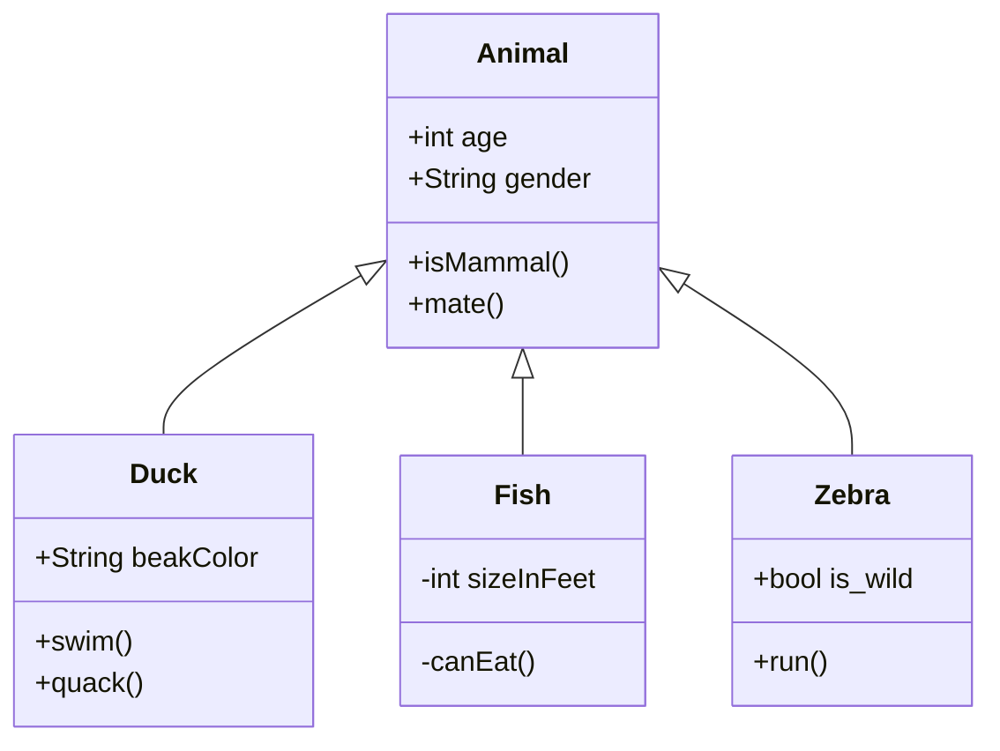
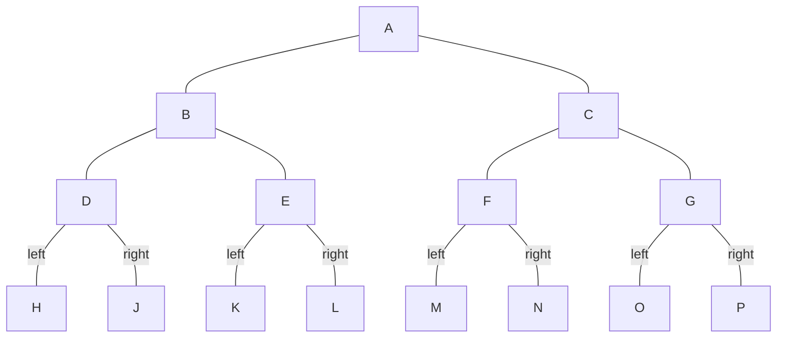

# 秋季

秋风吹不尽，总是玉关情。

# My nifty title

Some **text**!

```{admonition} Here's my title
:class: warning

Here's my admonition content
```

## 二级标题

```{mermaid}

    sequenceDiagram
      participant Alice
      participant Bob
      Alice->John: Hello John, how are you?
```


### 三级标题


#### 四级标题


春季
========

## uml: state diagram


春眠不觉晓，处处闻啼鸟。


```plantuml 

    '' This code is appended to the contents of basic.puml
    Goofy ->  MickeyMouse: calls
    Goofy <-- MickeyMouse: responds

```

@startuml component
actor client
node app
database db

db -> app
app -> client
@enduml


.. uml::

    Obj1 -> Obj2: Hello, world
    activate Obj2
    Obj2 --> Obj1: Goodbye, cruel world
    deactivate Obj2
春眠不觉晓，处处闻啼鸟。
