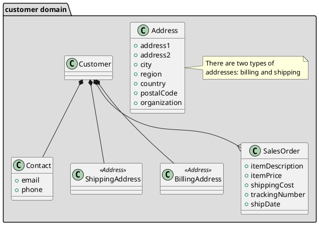
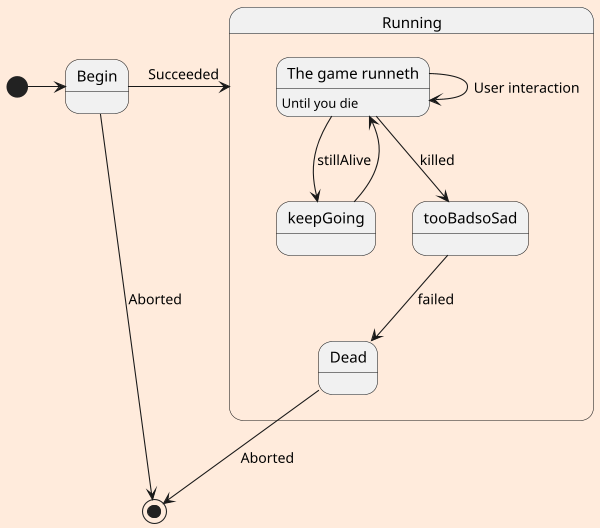
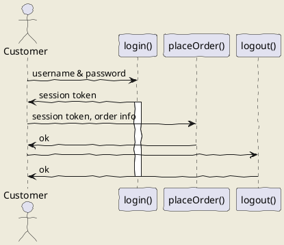

# 秋季

秋风吹不尽，总是玉关情。

## 二级标题


### 三级标题


#### 四级标题


春季
========

### uml: class diagram

## uml: state diagram



```plantuml source="basic.puml"
    '' This code is appended to the contents of basic.puml
    Goofy ->  MickeyMouse: calls
    Goofy <-- MickeyMouse: responds
```

@startuml component
actor client
node app
database db

db -> app
app -> client
@enduml


@startuml
'!include ../../plantuml-styles/plantuml-ae.iuml

skinparam Shadowing false

skinparam ArrowFontStyle normal
skinparam ArrowFontName Courier
skinparam ArrowFontSize 10

title Arrows in Use Case diagrams\n


(Manage Users) -up-|> (Management): This arrow is -up-|>

:All Users:      as allUsers #violet
:Main Admin:     as Admin    #saddleBrown
:User:           as U        #tan
:System Manager: as manager

Admin   -up-|>    allUsers: This arrow is -up->
manager -right-|> allUsers: This arrow is -right-|>
U       -|>       allUsers: This arrow is -|>

Admin --> U:    This arrow is -->
Admin <.....> U: This arrow is <.....>

Admin   -[#blue]->    (Manage Users): This arrow is -[#blue]->
manager -[#blue]->> (Manage Users): This arrow is -[#blue]->>


'!include ../../plantuml-styles/ae-copyright-footer.txt
@enduml


@startuml
'!include ../../plantuml-styles/plantuml-ae.iuml

skinparam ActorBorderColor   SaddleBrown
skinparam NoteFontStyle normal
skinparam Shadowing false


title Usecase Diagrams: Connecting Notes to Objects

(Use the application) as (Use)

User -[#LightSlateGray]-> (Start)
User -[#LightSlateGray]-> (Use)

note "This note is connected to \n two use cases \n and the User actor."  as N2  #white

(Start) <<-[#orange]- N2
N2 .[#magenta].|> (Use)
User <==[#DeepSkyBlue]==> N2

'!include ../../plantuml-styles/ae-copyright-footer.txt
@enduml

.. uml::
    Obj1 -> Obj2: Hello, world
    activate Obj2
    Obj2 --> Obj1: Goodbye, cruel world
    deactivate Obj2
春眠不觉晓，处处闻啼鸟。
