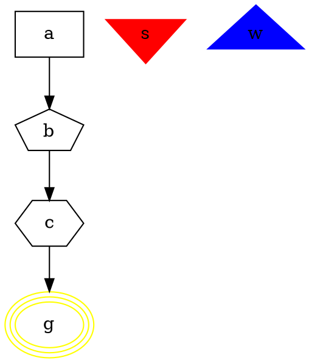

# 秋季

秋风吹不尽，总是玉关情。

## 二级标题

### 三级标题
dddd

```graphviz
   digraph Flatland {
   
      a -> b -> c -> g; 
      a  [shape=polygon,sides=4]
      b  [shape=polygon,sides=5]
      c  [shape=polygon,sides=6]
   
      g [peripheries=3,color=yellow];
      s [shape=invtriangle,peripheries=1,color=red,style=filled];
      w  [shape=triangle,peripheries=1,color=blue,style=filled];
      
      }
```
#### 四级标题

这是一个**段落**

| 作者 | 朝代 | 评分 |
| :--: | :--: | :--: |
| 李白 |  唐  | 100  |
